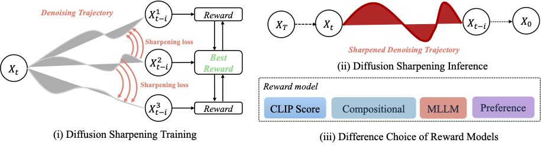
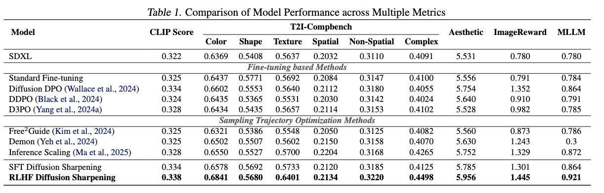
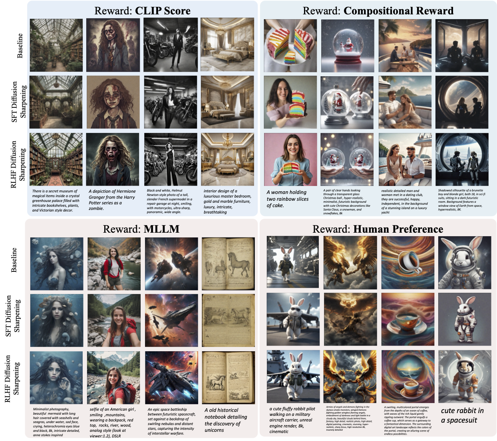

# Diffusion-Sharpening: Fine-tuning Diffusion Models with Denoising Trajectory Sharpeninging

This repository provides implementation for the paper ["Diffusion-Sharpeninging: Fine-tuning Diffusion Models with Denoising Trajectory Sharpeninging"]()

## 🔥 Features  
- **Trajectory-level optimization**: Guides the diffusion process toward high-reward regions.  
- **No additional inference cost**: Amortizes trajectory optimization into training.  
- **Generalized reward alignment**: Works with any reward model, including differentiable and non-differentiable objectives.  

## 📖 Introduction


Diffusion-Sharpeninging is a trajectory-level fine-tuning framework for diffusion models that autonomously optimizes sampling paths through reward-guided iterative refinement. By integrating self-alignment with a path integral approach, it eliminates the reliance on predefined datasets and amortizes inference costs into training, achieving superior efficiency in both convergence and inference.


## 🚀 Installation  
To set up the environment and install dependencies, run the following:  
```shell
git clone https://github.com/Gen-Verse/Diffusion-Sharpening
cd Diffusion-Sharpening
conda create -n Diffusion-Sharpening python==3.8.10
conda activate Diffusion-Sharpening
pip install -r requirements.txt
```

## 📚 Repository Structure  
```
Diffusion-Sharpening/
│── requirements.txt                        # Basic pip requirements  
│── reward.py                                # Reward model implementation (CLIPScore, ImageReward, Compositional Reward, MLLM Grader)  
│── mllm_template/                           # Custom templates for MLLM Grader  
│── train_sft_diffusion_sharpening_sdxl.py   # Main script for SFT-Diffusion-Sharpening  
│── train_rlhf_diffusion_sharpening_sdxl.py  # Main script for RLHF-Diffusion-Sharpening  
```

## 🔍 Reward Model Configuration  
We utilize four reward models for Diffusion-Sharpening training, with detailed configurations provided in `reward.py`:  
- **[CLIPScore](https://github.com/openai/CLIP)** – Measures text-image alignment.  
- **[ImageReward](https://github.com/THUDM/ImageReward)** – Evaluates human preference in image generation.  
- **[Compositional Reward](https://github.com/YangLing0818/IterComp)** – Provides composition-aware feedback for structured image generation.  
- **MLLM Grader** – Uses an MLLM API for overall image quality assessment. We employ **[GPT-4o](https://platform.openai.com/docs/models/gpt-4o)** in our experiments.


## 🏗️ SFT-Diffusion-Sharpening 
Supervised fine-tuning method that refines the diffusion trajectory using pre-existing image-text datasets, enabling efficient optimization with any reward model.
Example accelerate launch command:

```bash
# from scripts/sft.sh
export MODEL_NAME="stabilityai/stable-diffusion-xl-base-1.0"
export DATASET_NAME="your_dataset_name"

accelerate launch --main_process_port 10950 train_sft_diffusion_sharpen_sdxl.py  \
  --pretrained_model_name_or_path=$MODEL_NAME \
  --dataset_name=$DATASET_NAME \
  --enable_xformers_memory_efficient_attention \
  --resolution=512 --center_crop --random_flip \
  --proportion_empty_prompts=0.2 \
  --train_batch_size=1 \
  --gradient_accumulation_steps=4 --gradient_checkpointing \
  --max_train_steps=10000 \
  --use_8bit_adam \
  --learning_rate=1e-06 --lr_scheduler="constant" --lr_warmup_steps=0 \
  --mixed_precision="fp16" \
  --report_to="wandb" \
  --validation_prompt="a cute Sundar Pichai creature" --validation_epochs 5 \
  --checkpointing_steps=5000 \
  --output_dir="output_dir" \
  --reward_model="clip" (or "image_reward", "compositional", "mllm")
```

If you wish to use MLLM Grader, you can set your api key in the training command with `--api_key="your_api_key"` and `--base_url="your_base_url"`.

## 🏗️ RLHF-Diffusion-Sharpening Training Command 
Online reinforcement learning method that eliminates the need for curated datasets by generating positive and negative sample pairs dynamically during training.
Example accelerate launch command:
```bash
# from scripts/rlhf.sh
export MODEL_NAME="stabilityai/stable-diffusion-xl-base-1.0"
export DATASET_NAME="your_dataset_name"

accelerate launch --main_process_port 10950 train_rlhf_diffusion_sharpen_sdxl.py  \
  --pretrained_model_name_or_path=$MODEL_NAME \
  --dataset_name=$DATASET_NAME \
  --enable_xformers_memory_efficient_attention \
  --resolution=512 --center_crop --random_flip \
  --proportion_empty_prompts=0.2 \
  --train_batch_size=1 \
  --gradient_accumulation_steps=4 --gradient_checkpointing \
  --max_train_steps=10000 \
  --use_8bit_adam \
  --learning_rate=1e-06 --lr_scheduler="constant" --lr_warmup_steps=0 \
  --mixed_precision="fp16" \
  --report_to="wandb" \
  --validation_prompt="a cute Sundar Pichai creature" --validation_epochs 5 \
  --checkpointing_steps=5000 \
  --output_dir="output_dir" \
  --reward_model="clip" (or "image_reward", "compositional", "mllm")
``` 

## 📊 Results  




## 📜 Citation  
If you find this work useful, please consider citing:  
```bibtex
@article{tian2025sharpening,
  title={Diffusion-Sharpeninging: Fine-tuning Diffusion Models with Denoising Trajectory Sharpeninging},
  author={Tian, Ye and Yang, Ling and Zhang, Xinchen and Tong, Yunhai and Wang, Mengdi and Cui, Bin},
  journal={arXiv preprint arXiv:},
  year={2025}
}
```


